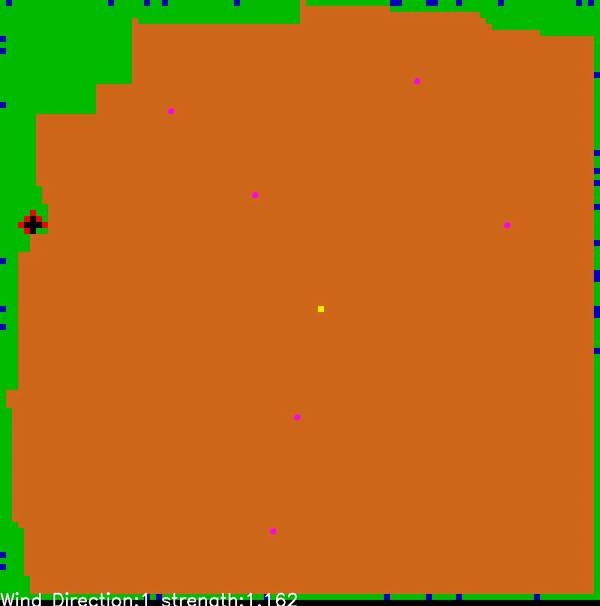
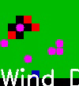

# Multi-Agent Deep Reinforcement Learning for Fighting Forest Fires
Forest Fires are an important cause of natural and economical damages that cost over 1 Billion dollars per year for fire retardant. Through addressing this problem we can save lives of firefighters and other humans and save natural resources and animal lives.
## Main parts
main parts of our project are: 1) the environment, 2) the agent, 3) the learning method.
### Environment
The environment we created has the following features:
  * Grid with any size 
  * Grid color shows its type:
      * Forest: Green Area
      * Areas without Tree: Brown Area
      * Burnt forest: Black Area
      * Drone Agents: Purple Squares
      * Fire: Red Squares
      * Houses: Blue Square
      * Station of Drones: Yellow Square
  * The fire propagates according to the direction of the wind using probability of transition<\br>
<\br>
<\br>
### Agent
Our agent is a simplified model of UAV drones. Its actions are: retarding the fire and Moving to 8 neighbors. Its sensors are a camera with 3X3 environment type and 3X3 environment state and a radio wich communicates and receives initial mean fire position (updated with camera data).
The agents group has the following structure:
* Level 0: queen that sends and recieves information to and from its workers and other queens
* Level 1: worker that sends and recieves information to and from scouts connected to it
* Level 2: scout that sends and recieves information to and from other scouts connected to it
### Genetic Algorithm
We used genetic algorithm to find the best number of each agents at each level. The Chromosome is numbers of queens, number of workers and # of scouts. The cross-over and mutation probability were 50 and 1 percent respectively.
### Learning Method
We used Double Q-learning with following parameters.
<\br>
### Result
The mean episodic rewrad of our problem and a gif of the result was aas follows.<\br>
<\br>

